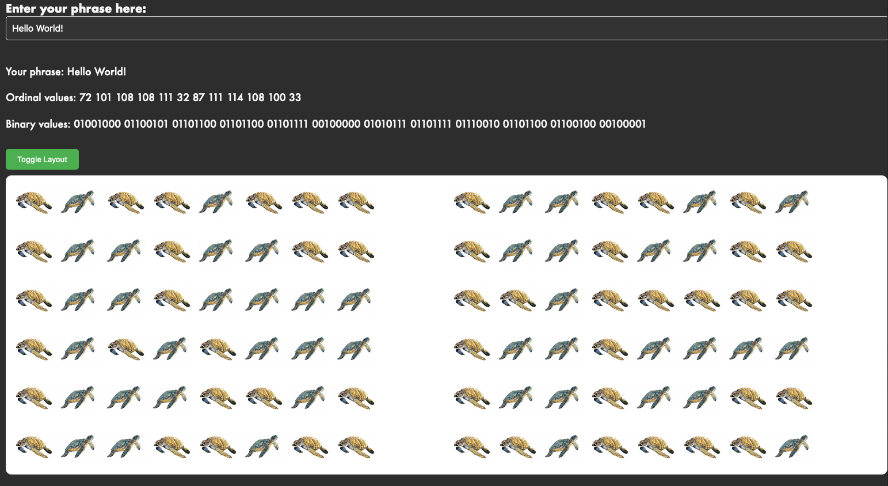

# Turtle Encoder 🐢

## Text -> Turtle binary

- Left facing turtle = 0
- Right facing turtle = 1

Reference: Speaking in Phases from NASA: https://www.jpl.nasa.gov/_edu/pdfs/phases_chart.pdf

Watercolor images used under a Creative Commons license, art by Frits Ahlefeldt.

